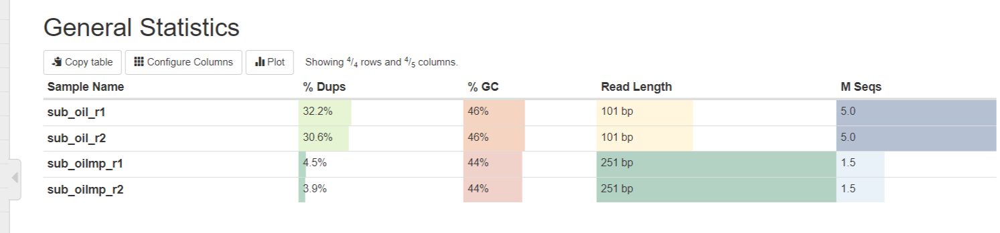
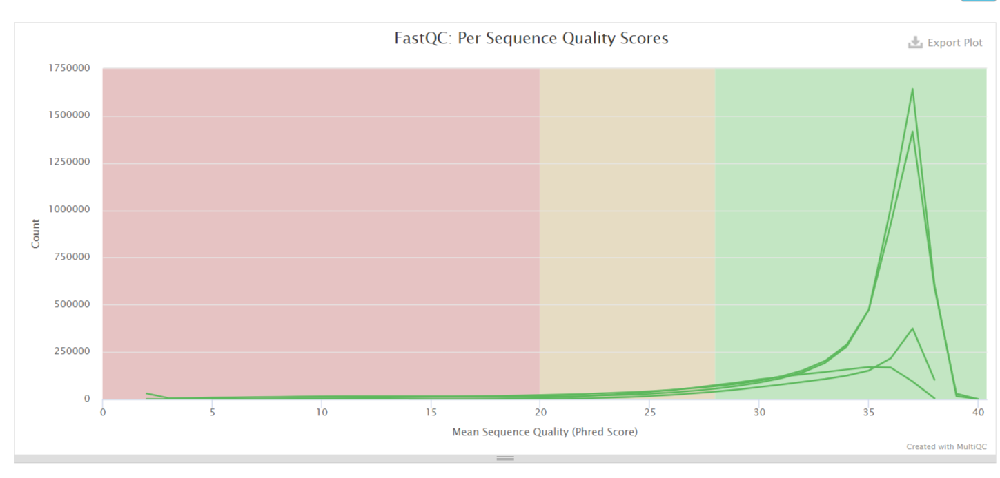
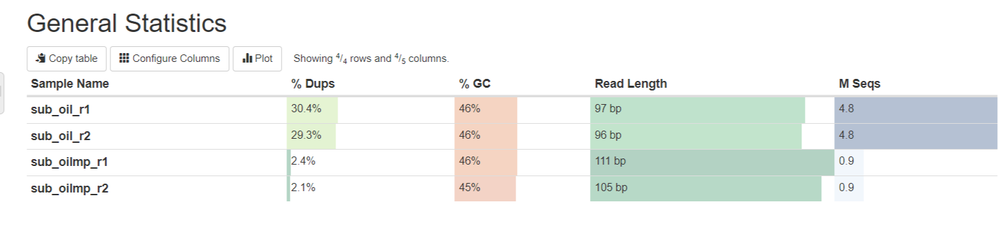
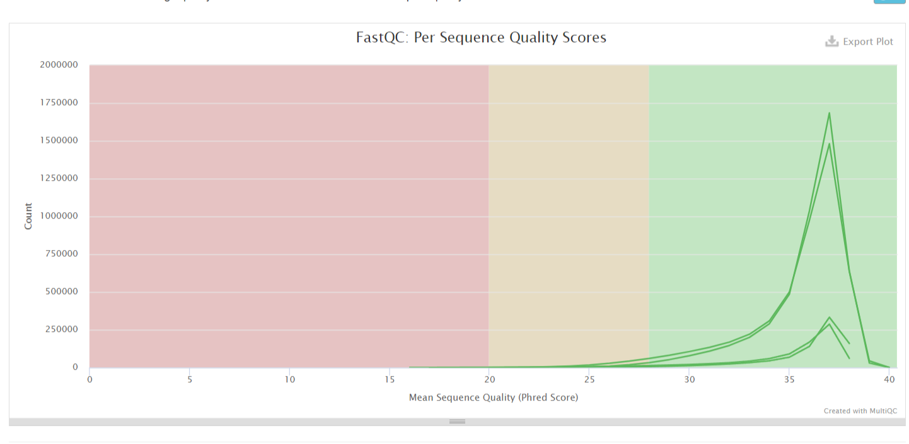

# hse23_hw1
## Колодин Матвей. 2 группа.
First homework by Bioinformatic in third course

## 1. Создаение символических ссылок в папке:
```
ln -s /usr/share/data-minor-bioinf/assembly/oil_R1.fastq
```

## 2. Выборка случайных чтений заданной длины:
```
seqtk sample -s607 oil_R1.fastq 5000000 > sub_oil_r1.fq
seqtk sample -s607 oil_R2.fastq 5000000 > sub_oil_r1.fq
seqtk sample -s607 oilMP_S4_L001_R1_001.fastq 1500000 > sub_oilmp_r1.fq
seqtk sample -s607 oilMP_S4_L001_R2_001.fastq 1500000 > sub_oil_r2.fq
```

## 3. Оценка чтений при помощи FastQC
```
mkdir fastqc
ls sub* matep* | xargs -tI{} fastqc -o fastqc {}
```

## 4. Создание отчета при помощи MultiQC
```
mkdir multiqc
multiqc -o multiqc fastqc
```

## 5. Подрезание чтений и удалений адаптеров при помощи Platanus
```
platanus_trim sub_oil_*
platanus_internal_trim sub_oilmp*
```

## 6. Удаляение начальных файлов
```
rm sub*.fq
```

## 7. Получение качества обрезанных чтений через FastQC
```
mkdir fastqc_trim
ls sub* matep*| xargs -tI{} fastqc -o fastqc_trim {}
```

## 8. Создание отчета для обрезанных чтений
```
mkdir multiqc_trim
multiqc -o multiqc_trim fastqc_trim
```

## 9. Сбор контигов из подрезанных чтений через Platanus
```
time platanus assemble -o Poil -f sub_oil_r1.fq.trimmed sub_oil_r2.fq.trimmed 2> err.log
```

## 10. Сбор скаффолдов из контигов и подрезанных чтений через Platanus
```
time platanus scaffold -o Poil -c Poil_contig.fa -IP1 sub_oil_r1.fq.trimmed sub_oil_r2.fq.trimmed -OP2 sub_oilmp_r1.fq.int_trimmed sub_oilmp_r2.fq.int_trimmed 2> err_scaf.log
```

## 11. Уменьшение количества гэпов при помощи подрезанных чтений
```
time platanus gap_close -o Poil -c Poil_scaffold.fa -IP1 sub_oil_r1.fq.trimmed sub_oil_r2.fq.trimmed -OP2 sub_oilmp_r1.fq.int_trimmed sub_oilmp_r2.fq.int_trimmed 2> err_gap.log
```

## 12. Удаялем подрезанные чтения
```
rm sub*.trimmed matep*.int_trimmed
```

# Тетрадка с кодом:
[Клик](https://colab.research.google.com/drive/1lyWMpQfHk0wZs59F9fC2ui60jlahFd4h?usp=sharing)

# Отчеты от MultiQC:
## Для начальных чтений:



## Для подрезанных чтений:

